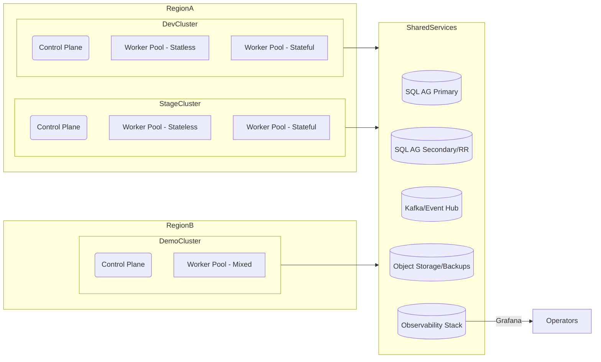

title: Infrastructure Architecture for PIM SRE Lab
doc_type: infrastructure_architecture
status: draft
version: 0.2.0
owners:
  - platform@pim-sre.lab
last_updated: 2025-05-19
tags:
  - infrastructure
  - architecture
---

# Overview

The PIM SRE Lab infrastructure spans dual kubeadm-managed clusters that simulate national-scale healthcare workloads using purely synthetic data (BR-01, BR-02). GitOps controllers reconcile declarative manifests for compute, networking, storage, and observability so environments remain reproducible and auditable (BR-03, BR-09, FR-09.1). Each layer is instrumented for MELTP telemetry, supporting the lab’s goal of narratable SRE scenarios for humans and GPT collaborators (BR-06, BR-12, BR-16).

Workloads are stateless microservices backed by sharded SQL Server availability groups, event-driven projections, and persona simulators that drive configurable traffic mixes (FR-01.2, FR-03.1, FR-04.3). The infrastructure must tolerate chaos experiments and failure drills without breaching SLOs, relying on redundant control planes, autoscaling pools, and automated recovery tooling (BR-05, BR-11, FR-05.1, NFR-34).

## Objectives

- Deliver horizontally scalable compute, storage, and network fabric configurable via GitOps to support rapid environment resets and demos (BR-03, BR-09, FR-03.3, FR-09.2).
- Preserve strict synthetic data boundaries and auditable traceability across all infrastructure operations (BR-02, BR-07, FR-07.1, FR-02.3).
- Provide MELTP observability coverage, SLO-ready metrics, and chaos readiness instrumentation baked into the platform (BR-06, BR-10, FR-06.5, FR-11.1).
- Ensure redundancy, automated failover, and disaster recovery that meet published RPO/RTO targets for all critical components (BR-05, FR-05.2, NFR-05, NFR-21).
- Educate operators and GPT agents by keeping infrastructure stories narratable, well-documented, and linked to decision records (BR-12, BR-16, FR-13.1).

## Scope and Assumptions

- Covers dev, stage, and demo clusters, shared network services, observability pipelines, and data storage subsystems supporting the lab scenarios (FR-03.1, FR-06.3).
- Assumes kubeadm clusters run across two availability zones per environment with dedicated control planes and managed worker pools (FR-05.1, NFR-03).
- Assumes personas, datasets, and traffic profiles originate from the simulation engine and follow requirements for synthetic identities (FR-01.1, FR-02.1).
- Out of scope: individual microservice implementation details, application schema evolution, and cost optimization beyond capacity guardrails (delegated to service teams and financial ops).
- External integrations beyond the lab boundary (e.g., partner systems) are excluded unless registered via ADRs (BR-16, FR-X.1).

## Environment Topology

Clusters reside in separate network segments connected via secured VPN/peering. Shared services leverage dedicated subnets with firewall policies that enforce shard locality and role isolation (FR-04.1, FR-08.2). Observability tooling (Prometheus, Loki, Tempo, Pyroscope) is centralized but multi-tenant aware, with per-environment dashboards and SLOs (FR-06.3, FR-10.1).

## Platform Services

- **Compute** — Kubernetes worker pools provisioned via Cluster API templates; autoscaling policies respect persona load windows and chaos experiments (FR-03.1, FR-05.4).
- **Storage** — SQL Server in Always On availability groups with dedicated SSD storage classes, plus object storage for artifacts and backups (FR-04.3, FR-17.1, NFR-23).
- **Messaging** — Kafka-compatible event backbone with schema registry enforcing topic contracts and replay retention policies (FR-14.2, FR-14.4).
- **Observability** — Prometheus federation, Loki log aggregation, Tempo traces, Pyroscope profiles; exposed via Grafana dashboards curated per persona (FR-06.3, FR-06.4, FR-13.1).
- **Secrets & Config** — External secrets operator integrates with a hardened vault; environment configs stored in Git with Sealed Secrets for distribution (FR-03.3, FR-08.4, NFR-19).
- **GitOps Tooling** — Flux/Argo CD controllers with policy agents (Kyverno/OPA Gatekeeper) enforcing guardrails such as ADR-required annotations (FR-09.1, FR-09.4, NFR-12).
- **CI/CD** — Pipeline runners located in a restricted subnet with network policies permitting only Git, registry, and cluster API access (FR-09.2, NFR-18).

## Networking and Access Control

Virtual networks segment control planes, workloads, and shared services with explicit routing tables and firewall policies enforcing least privilege (FR-08.4, NFR-19). Ingress traffic terminates at a gateway with WAF, rate limiting, and mutual TLS for internal services (FR-04.1, NFR-06). East-west traffic between services uses a service mesh with mTLS and policy-based routing to respect shard boundaries (FR-04.2, FR-08.3). Identity is federated through OIDC tokens mapped to Kubernetes RBAC groups and namespace-level roles; secrets are stored encrypted at rest and rotated automatically via GitOps pipelines (FR-08.2, NFR-20).

## Security and Compliance

All data at rest uses AES-256 encryption via storage class defaults; in-transit traffic is TLS 1.2+ with automated certificate rotation (FR-02.3, NFR-24). Infrastructure changes require signed commits and protected branches, ensuring auditable provenance (BR-07, FR-07.1, NFR-12). Compliance controls align with HIPAA-like safeguards despite synthetic data, including network isolation, RBAC, logging, and backup policies (NFR-21, NFR-22). Secrets management ties into hardware-backed entropy sources and enforces rotation windows per NFR-20. ADRs capture deviations or compensating controls when new services onboard (FR-X.1).

## Reliability, Availability, and DR

Control planes run as stacked etcd clusters with quorum across three nodes; worker pools use PDBs and topology spread constraints to limit blast radius (FR-05.1, NFR-03). SQL Server AG provides synchronous replication for critical shards with automatic failover and asynchronous replicas for read-heavy workloads (FR-04.3, FR-05.2, NFR-05). Backups leverage differential snapshots plus nightly full backups retained per NFR-23; restores are rehearsed monthly via the Availability & DR topology runbooks (FR-17.2, NFR-25). Chaos experiments simulate node loss, network partitions, and replica lag, with telemetry verifying SLO compliance during drills (FR-11.1, NFR-34).

## Capacity and Cost Modeling

Persona-driven load models and synthetic datasets define baseline CPU, memory, and storage footprints for each environment (FR-01.4, FR-03.2). Horizontal pod autoscalers monitor request latency and custom SLO signals, whereas cluster autoscaler manages node pools within predefined bounds (FR-03.1, FR-10.1). Storage scaling leverages shard addition and read replica tuning coordinated through ADRs when thresholds exceed 80% utilization (FR-04.2, FR-17.3). Cost visibility uses Prometheus metrics and Kubecost-style dashboards to attribute expenses to services while honoring synthetic data constraints (NFR-27, NFR-28).

## Operations and Tooling

Infrastructure-as-code uses Terraform and Helm charts stored alongside ADR references; GitOps controllers reconcile desired state and raise alerts on drift (FR-09.1, FR-09.3). Monitoring and alerting integrate with Grafana Alerting and Slack/Teams webhooks, with escalation policies aligned to SLI/SLO measurement plan outcomes (FR-10.3, NFR-13). Incident response runbooks live under `/docs/runbooks/` and reference this architecture for dependencies and rollback steps (NFR-18, FR-11.2). Operational reviews ensure observability, security scans, and compliance audits remain up to date, with GPT agents cross-checking guardrail adherence (BR-12, NFR-32).

## Risks and Mitigations

- **Control plane failure** — Mitigated via multi-node HA, etcd backups, and rapid rebuild scripts validated quarterly (FR-05.1, NFR-05).
- **Shard skew or hot spots** — Addressed by automated shard balancing jobs, proactive capacity alarms, and ADR-governed shard expansion (FR-04.2, FR-17.4).
- **Secrets exposure** — Prevented by sealed secrets, vault integrations, and automated rotation with audit logging (FR-08.4, NFR-20).
- **Observability gaps** — Remediated by MELTP coverage audits, schema validation pipelines, and SLO burn dashboards (FR-06.5, FR-13.1).
- **GitOps misconfigurations** — Mitigated through policy controllers, dry-run previews, and mandatory ADR checkpoints for high-impact changes (FR-09.4, NFR-12).
- **Resource exhaustion during chaos drills** — Controlled via guardrail tooling that enforces blast radius, time limits, and automatic rollback (FR-11.1, NFR-34).

## Open Questions

- Select between in-cluster vs. managed Kafka for long-term event durability, documenting trade-offs in an ADR (FR-14.2, NFR-21).
- Finalize cross-cluster service discovery approach when scaling beyond two regions (FR-04.1, NFR-03).
- Determine budget thresholds and automation for scaling down non-critical workloads during idle windows (FR-03.3, NFR-33).
- Evaluate infrastructure support for future partner integrations requiring secure network ingress (BR-16, FR-X.2).
- Confirm tooling for automated ADR updates when infrastructure decisions impact multiple components.

## References

- `docs/Architecture/00_Design_Doc.md` — Overall platform design context.
- `docs/requirements/notes/Infrastructure_Architecture_Applicable_Requirements.md` — Requirements summary referenced here.
- `docs/templates/04_Infrastructure_Architecture_Template.md` — Source template guiding this draft.
- `docs/requirements/notes/Availability_DR_Topology_Applicable_Requirements.md` — DR-specific requirements for further detail.
- `docs/ADR/ADR_Index.md` — Record of architecture decisions affecting infrastructure components.
- `docs/Docs_Index.md` — Navigation for related design and operations documents.

---

#### Notes

Last updated: 2025-05-19 (update before publishing)
