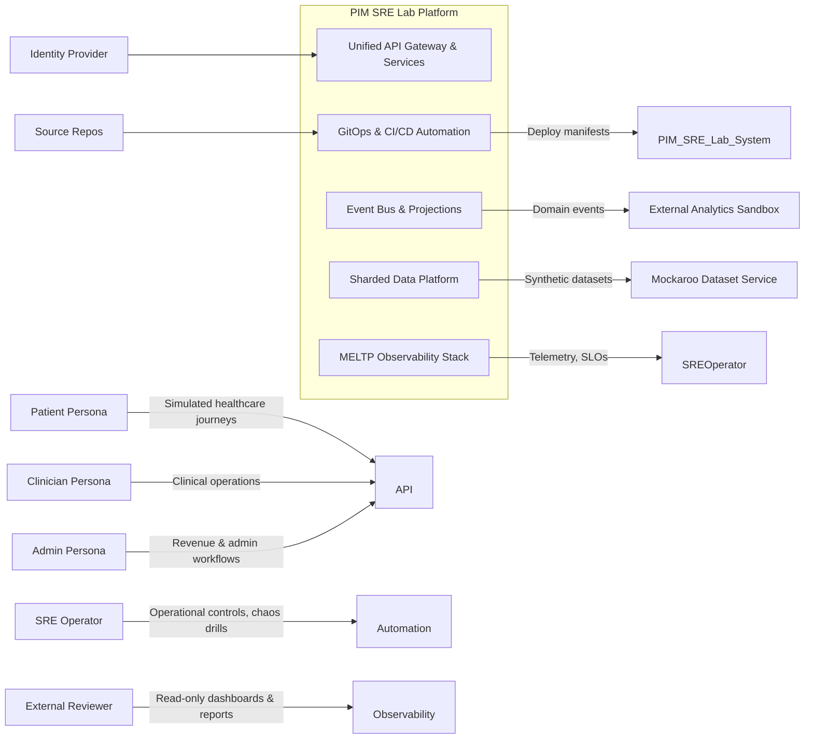

title: PIM SRE Lab – C4 Level 1 System Context
doc_type: c4_l1_system_context
status: draft
version: 0.2.0
owners:
  - docs@pim-sre.lab
last_updated: 2025-05-19
tags:
  - architecture
  - c4
---

# System Context

The PIM SRE Lab platform simulates a national-scale healthcare system using synthetic data, enabling SRE practices without risking PHI (BR-01, BR-02). The lab boundaries enclose persona simulators, API surfaces, domain services, data stores, and observability tooling that together deliver MELTP coverage and narratable operational stories (BR-06, BR-12, BR-16). External actors interact with the platform through secure entry points that enforce shard-aware routing, role-based access, and auditability (BR-04, BR-07, FR-04.1, FR-08.1).

This context clarifies how humans, partner systems, and supporting services engage with the lab, ensuring requirements for scalability, resilience, and GitOps reproducibility are met at the highest level (BR-03, BR-05, BR-09). It establishes the scope that downstream C4 layers, design docs, and runbooks elaborate on.

## Diagram

_Source:_ `docs/architecture/diagrams/c4_l1_system_context.mmd` (to be generated via `make diagrams`).

## Actors

| Actor | Description | Interaction Summary |
| --- | --- | --- |
| Patient Persona | Simulated patient using mobile and portal flows | Exercises appointment booking, encounter reviews, and billing checks through persona scripts (BR-01, FR-01.2). |
| Clinician Persona | Simulated clinician handling care delivery | Executes clinical workflows, writes notes, and reviews telemetry for care delivery (BR-01, FR-01.3). |
| Admin Persona | Simulated back-office/billing staff | Manages claims, compliance reports, and revenue operations (BR-01, FR-01.3). |
| SRE Operator | Human or GPT agent operating the platform | Triggers deployments, chaos drills, and observability reviews via GitOps and runbooks (BR-11, BR-12, FR-11.2). |
| External Analytics Sandbox | Isolated environment for downstream analysis and storytelling | Subscribes to curated event streams and reports for educational narratives (BR-14, BR-16). |
| Identity Provider | Authentication broker for personas and operators | Issues OIDC tokens, enabling RBAC enforcement at the gateway (FR-08.1, NFR-19). |
| Mockaroo Dataset Service | Synthetic data seed provider | Supplies pseudonymized datasets refreshed via pipelines (BR-02, FR-01.1). |
| Source Control & CI/CD | GitHub + runners | Hosts declarative manifests and automates deployments through GitOps controllers (BR-09, FR-09.1). |

## System Responsibilities

- Deliver realistic healthcare workflows, telemetry, and failure scenarios using synthetic data while maintaining shard locality and observability depth (BR-01, BR-04, BR-06, FR-04.1, FR-06.5).
- Provide operational tooling, GitOps automation, and chaos interfaces to teach SRE practices and enable reliability experimentation (BR-09, BR-11, BR-12, FR-11.1, FR-11.2).
- Maintain auditable history, role-based access, and documented narratives for both human and AI consumers (BR-07, BR-15, BR-16, FR-07.1, FR-08.2).
- The system does **not** host production PHI, serve real patients, or integrate directly with external production healthcare systems; any such integration must be explicitly approved via ADR (BR-02, FR-X.1).
- External analytics platforms may consume published datasets but cannot mutate lab state without going through defined interfaces (FR-14.4, NFR-19).

## External Dependencies

- **Identity Provider** — Provides OIDC tokens; availability directly influences user access. Requires OIDC/OAuth compliance and cert rotation within NFR-20 timelines.
- **Mockaroo Dataset Service** — Supplies synthetic data via secured APIs or offline bundles; pipelines must validate schemas before ingestion (FR-01.1, FR-02.1).
- **Source Control & CI/CD** — GitHub and runners provide GitOps workflows, requiring webhooks and runner connectivity; downtime delays deployments (FR-09.1, FR-09.2).
- **External Analytics Sandbox** — Receives curated streams; contracts define read-only access and retention policies (FR-14.5, NFR-23).
- **Secrets Management Vault** — Stores credentials and signing keys for the platform; SLA ensures rotation and retrieval meet FR-08.4 and NFR-20 requirements.

## Security and Compliance Considerations

All entry points enforce authentication via the identity provider, tagging requests with persona and shard metadata for deterministic routing (FR-04.1, FR-08.1). Authorization leverages RBAC, namespace policies, and service mesh enforcement to keep personas and operators within their blast radius (FR-08.2, NFR-19). Audit logs capture request IDs, actions, and before/after states in immutable storage for compliance narratives (BR-07, FR-07.1). Synthetic datasets remain pseudonymized, encrypted at rest, and never leave approved storage classes (BR-02, NFR-24).

## Operational Concerns

GitOps pipelines promote changes from dev → stage → demo clusters, each instrumented with MELTP dashboards, SLO burn alerts, and chaos scheduling hooks (BR-05, BR-10, FR-10.3, NFR-33). Operators must run `make docs-validate` and infrastructure conformance scripts before merges, with ADRs documenting impactful decisions (FR-09.4, FR-X.1). On-call rotations alternate between human SREs and GPT agents following the GPT Working Agreement, ensuring alert ownership and escalation paths stay clear (BR-12, NFR-13).

## Risks and Open Questions

- **Identity provider outage** — Mitigate via cached tokens and documented failover to secondary IdP; owner: Platform Identity Team (FR-08.1, NFR-05).
- **Dataset drift or schema mismatch** — Require automated validation and approval workflows before dataset refreshes; owner: Data Platform Team (FR-01.1, FR-02.2).
- **External analytics overreach** — Enforce read-only contracts and monitoring for unusual access patterns; owner: Observability Team (FR-14.5, NFR-19).
- **Narrative coverage gaps** — Schedule quarterly reviews to ensure personas and telemetry remain aligned with learning objectives; owner: Education Enablement (BR-12, BR-16).
- Open question: Evaluate whether additional partner personas (e.g., payer systems) are needed to broaden educational scenarios; track via ADR proposal.

## References

- `docs/Architecture/00_Design_Doc.md`
- `docs/requirements/notes/C4_L1_System_Context_Applicable_Requirements.md`
- `docs/Architecture/04_Infrastructure_Architecture.md`
- `docs/templates/05_C4_L1_System_Context_Template.md`
- `docs/04_GPT5_Working_Agreement.md`
- `docs/ADR/ADR_Index.md`

---

#### Notes

Last updated: 2025-05-19 (update before publishing)
