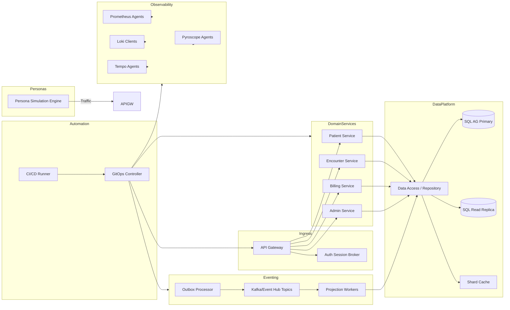

title: PIM SRE Lab – C4 Level 2 Containers
doc_type: c4_l2_containers
status: draft
version: 0.2.0
owners:
  - docs@pim-sre.lab
last_updated: 2025-05-19
tags:
  - architecture
  - c4
---

# Container Overview

The PIM SRE Lab runs a set of GitOps-managed containers that simulate healthcare workflows, expose APIs, process domain events, and maintain telemetry coverage without handling real PHI (BR-01, BR-02). Containers are grouped into ingress/API, domain services, data access, event processing, persona simulation, and observability/automation stacks. Each container is stateless where possible, scaling horizontally via Kubernetes HPA and pulling configuration from environment values and GitOps manifests (FR-03.1, FR-03.3).

Event-driven patterns connect write workloads to projections and analytics containers, ensuring consistency and audit trails while supporting chaos experimentation and SLO validation (BR-05, BR-06, FR-05.4, FR-14.2). Security boundaries and RBAC are enforced at the container level using service mesh policies, JWT claims, and shard-aware data access (BR-08, FR-08.2, NFR-19).

## Container Diagram

_Source:_ `docs/architecture/diagrams/c4_l2_containers.mmd`.

## Container Catalog

| Container | Purpose / Responsibilities | Technology Stack | Interfaces / APIs |
| --- | --- | --- | --- |
| API Gateway | Terminates ingress, enforces authentication, rate limits, and shard routing (FR-04.1, FR-08.1) | Envoy + Lua filters, OPA policies | Receives persona traffic, calls downstream REST/gRPC services |
| Auth Session Broker | Exchanges OIDC tokens, enriches headers with role/shard metadata (FR-08.4) | .NET / Node, Redis cache | Interfaces with IdP; returns signed session context to gateway |
| Patient Service | Handles patient demographics, encounters, and portal views (FR-01.2, FR-03.4) | .NET API, EF Core | RESTful API, publishes events, calls repository layer |
| Encounter Service | Manages clinical workflows, care notes, and telemetry anchors (FR-01.3, FR-06.5) | .NET API, background workers | REST API, subscribes to events, writes to SQL |
| Billing Service | Processes claims, billing cycles, and revenue reports (FR-01.3, FR-14.4) | .NET API + Hangfire jobs | REST API, event subscriptions, exports financial projections |
| Admin Service | Provides admin/SRE operations (feature flags, audit queries) (FR-08.3, FR-07.3) | Go API | REST API, integrates with GitOps/webhooks |
| Data Access Layer | Shared repository for sharded SQL, read replicas, and caching (FR-04.3, FR-05.3) | .NET shared package, Dapper, Redis | gRPC/REST from services, SQL server connections |
| Outbox Processor | Reads transaction outbox tables and publishes domain events (FR-14.2, FR-05.5) | .NET worker | SQL outbox tables, Kafka topics |
| Event Bus | Durable messaging backbone for domain events (FR-14.2, NFR-21) | Kafka / Redpanda | Topics for services, analytics, and projections |
| Projection Workers | Build read models, dashboards, and analytics caches (FR-14.4, FR-10.1) | .NET worker, Materialized views | Consume events, write to SQL/Elastic |
| Persona Simulation Engine | Generates personas, load profiles, and chaos hooks (FR-01.4, FR-11.1) | Python/Go orchestrator | Calls gateway, publishes telemetry, triggers chaos APIs |
| Observability Agents | Collect metrics/logs/traces/profiles with consistent labels (FR-06.1–FR-06.5) | Prometheus, Loki, Tempo, Pyroscope Agents | Ship telemetry to observability stack |
| GitOps Controller | Reconciles manifests and policy controls (BR-09, FR-09.1) | Flux / Argo CD | Watches Git, applies resources to clusters |
| CI/CD Runner | Builds, tests, and triggers GitOps promotions (FR-09.2, FR-10.2) | GitHub Actions / Tekton | Calls make targets, updates Git branches, posts status to GitOps |

## Deployment / Runtime Considerations

Containers run on dev, stage, and demo Kubernetes clusters, deployed via Helm charts managed by Flux and validated by policy agents (FR-09.1, FR-09.4). Stateless services use HPA with CPU, latency, and error-rate triggers; stateful workloads rely on StatefulSets with pod disruption budgets and topology spread (FR-03.1, FR-05.1, NFR-03). Configuration values (shard maps, connection strings, feature flags) come from ConfigMaps, Secrets, and sealed secrets maintained in Git repositories (FR-03.3, FR-08.4). Chaos tooling can inject pod failures, latency, and replica drains to ensure resilience claims remain valid (FR-05.4, NFR-34).

## Data and State Considerations

Domain services are stateless aside from transient request context; persistent state lives in the SQL Server shard topology with Always On availability groups and read replicas (FR-04.3, FR-05.2). The data access layer coordinates shard selection and caching, ensuring deterministic routing by patient ID and caching frequently accessed reference data (FR-04.1, FR-04.4). Outbox processors maintain reliable event publishing, guaranteeing idempotent delivery through transactionally consistent tables (FR-03.4, FR-14.2). Projection workers store materialized views and analytics caches with retention and archival policies aligned to NFR-23. Secrets and credentials stay in vault-backed secret stores, rotated per policy (FR-08.4, NFR-20).

## Security and Compliance

Edge containers validate OIDC tokens and enforce persona-aware RBAC, while service mesh policies restrict east-west traffic to approved namespaces and workloads (FR-08.1, FR-08.2, NFR-19). Sensitive configuration (connection strings, signing keys) is encrypted at rest and only mounted where required, using sealed secrets and external secrets operators (FR-08.4, NFR-24). Audit events are emitted from every write path, enriched with user and request identifiers and persisted in immutable storage (FR-07.1, FR-07.3). Chaos and admin endpoints require SRE role tokens with additional guardrails documented in ADRs (BR-11, FR-08.3).

## Observability and Operations

All containers emit structured logs with trace IDs, user IDs, and persona metadata to support observability-driven debugging (FR-06.2, FR-13.1). Metrics follow RED + USE conventions and feed SLO dashboards consumed by the SLI/SLO Measurement Plan (FR-06.3, FR-10.1). Tracing instrumentation spans inbound requests, domain services, database calls, and event pipelines, with sampling tuned for persona journeys and chaos scenarios (FR-06.1, FR-06.5). Alerting thresholds and runbooks live in `/docs/runbooks/` and reference container responsibilities for triage steps; GitOps controllers annotate deployments and chaos experiments for post-event reviews (FR-10.3, NFR-33, NFR-36).

## Risks and Open Questions

- **Shard routing misconfiguration** — Mitigate by automated validation of shard maps and blue/green deployments for updates; owner: Data Platform Team (FR-04.1, FR-04.2).
- **Outbox/event backlog growth** — Address with autoscaling, dead-letter monitoring, and replay tooling; owner: Event Platform Team (FR-14.5, NFR-18).
- **Observability label drift** — Enforce schema validation in CI and periodic audits of telemetry metadata; owner: Observability Team (FR-06.5, NFR-32).
- **Secrets rotation drift** — Integrate vault rotation alarms and GitOps checks to ensure new versions are applied; owner: Security Engineering (FR-08.4, NFR-20).
- Open question: Evaluate if additional persona-specific services are needed (e.g., partner portal) to expand educational scenarios; track via upcoming ADR.

## References

- `docs/Architecture/00_Design_Doc.md`
- `docs/requirements/notes/C4_L2_Containers_Applicable_Requirements.md`
- `docs/Architecture/04_Infrastructure_Architecture.md`
- `docs/templates/06_C4_L2_Containers_Template.md`
- `docs/Architecture/05_C4_L1_System_Context.md`
- `docs/ADR/ADR_Index.md`
- `docs/requirements/notes/Domain_Context_Map_Applicable_Requirements.md`

---

#### Notes

Last updated: 2025-05-19 (update before publishing)
