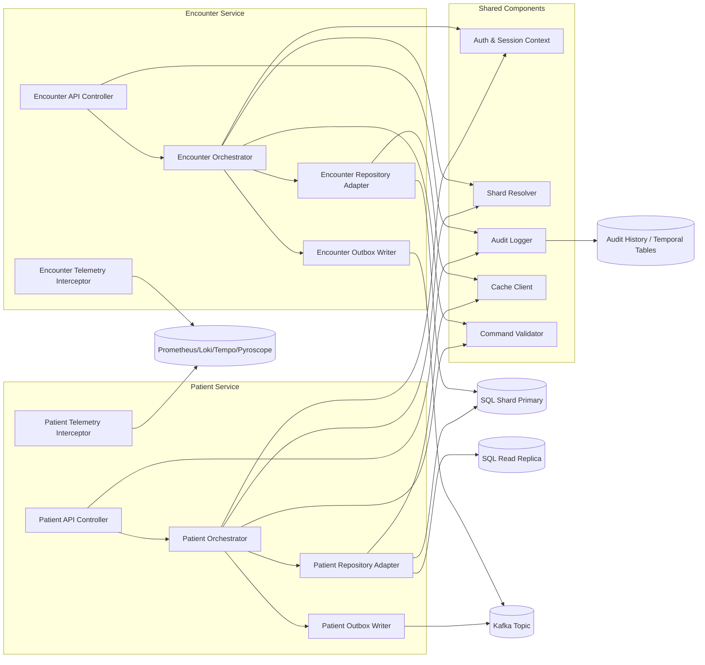

title: PIM SRE Lab – C4 Level 3 Component Detail
doc_type: c4_l3_components
status: draft
version: 0.2.0
owners:
  - docs@pim-sre.lab
last_updated: 2025-05-19
tags:
  - architecture
  - c4
---

# Component Overview

This view zooms into the core application services container group (Patient, Encounter, Billing, Admin) to show the internal components that satisfy persona workflows, audit requirements, and observability guarantees (BR-01, BR-07, BR-13). Components include API layers, orchestration modules, repository adapters, event publishers, and telemetry interceptors that enforce shard-aware routing, audit logging, and MELTP signal generation (FR-04.1, FR-07.1, FR-06.5). The diagram highlights how synthetic data, GitOps workflows, and chaos tooling integrate at the component level.

## Component Diagram

_Source:_ `docs/architecture/diagrams/c4_l3_components.mmd`.

## Component Catalog

| Component | Responsibilities | Key Interfaces | Notes |
| --- | --- | --- | --- |
| Patient API Controller | Validates requests, maps DTOs, and ensures persona/session metadata are present (FR-08.4, FR-16.1) | Receives HTTP from API Gateway; returns REST responses | Owners: Application Team; intercepts requests to attach trace IDs |
| Patient Orchestrator | Coordinates domain workflows, applies business rules, triggers audit/log events (FR-03.4, FR-07.1) | Calls repository adapter, cache client, shard resolver | Maintains idempotency and retry policies |
| Patient Repository Adapter | Executes shard-aware SQL operations and leverages read replicas for GETs (FR-04.1, FR-04.3) | Dapper/EF to SQL shards; fallback to cache | Implements exponential backoff per FR-05.3 |
| Patient Outbox Writer | Persists domain events to outbox table for eventual publishing (FR-14.2) | Writes to SQL outbox schema | Ensures event schema versioning aligns with FR-14.3 |
| Patient Telemetry Interceptor | Captures MELTP signals (metrics/logs/traces/profiles) (FR-06.1–FR-06.5) | Prometheus exporters, Loki logs, Tempo spans | Adds persona/shard labels for SLO rollups |
| Encounter API Controller | Mirrors Patient API responsibilities for encounter workflows (FR-01.3, FR-08.1) | HTTP from gateway; RBAC-enforced endpoints | Additional hooks for clinician persona documentation |
| Encounter Orchestrator | Implements encounter-specific business logic and failure evidence capture (FR-05.5, FR-15.1) | Repository adapter, audit logger, outbox | Integrates chaos hooks for clinician scenarios |
| Shared Auth & Session Context | Normalizes JWT claims, persona metadata, and request IDs (FR-08.4) | Provided via middleware | Shared across services to maintain consistent context |
| Shard Resolver | Maps patient identifiers to shard endpoints; supports hot updates (FR-04.2) | Reads shard map config; caches results | Warmed via GitOps-delivered ConfigMaps |
| Audit Logger | Records before/after state, actor, and request metadata (FR-07.1, FR-07.2) | Writes to audit and temporal tables | Publishes audit events into observability for correlation |
| Cache Client | Manages Redis-backed caching for reference data and session hints (FR-04.4) | Redis, in-memory cache | Enforces TTLs and invalidation policies |
| Command Validator | Applies schema validation, business invariants, and redaction checks (FR-02.2, FR-02.4) | Called by orchestrators | Integrates with glossary/requirements to keep terminology consistent |

## Collaboration and Flows

Persona requests enter through API controllers, which validate context and route to orchestrators. Orchestrators call validators, resolve shard placement, and execute repository operations. Writes persist domain events via outbox writers, which later stream to the event bus for projections. Telemetry interceptors wrap each call, emitting traces and metrics with persona tags while audit logger records state changes. Sequence diagrams will live under `docs/Architecture/08_Runtime_Sequence_Catalog.md` to detail flows such as patient encounter creation and billing submission (FR-14.4, FR-16.2).

## Data and State Handling

Components rely on temporal tables and audit history to retain before/after data for compliance (FR-07.2, NFR-21). Repository adapters enforce read/write splits, caching reference data (e.g., providers, facilities) and invalidating entries on update events (FR-04.3, FR-04.4). Outbox writers and event publishers guarantee idempotent event delivery using transactionally consistent tables, and they annotate events with persona metadata for downstream analytics (FR-14.2, FR-15.2). No component stores PHI-like data outside the approved shards, and all sensitive fields follow masking/redaction rules defined in validators (FR-02.3, NFR-24).

## Security and Compliance

Auth & Session Context ensures JWT claims and persona IDs propagate through each component, enabling per-request audit and RBAC enforcement (FR-08.1, FR-08.4). Validators check for unauthorized operations, enforce least privilege, and scrub sensitive data from logs (FR-02.4, FR-08.3). Audit Logger writes immutable records with cryptographic signing options for future compliance enhancements (BR-07, FR-07.3). Components enforce glossary-consistent classifications and tag data flows for external analytics to prevent overreach (BR-16, FR-14.5).

## Testing and Observability

Unit tests cover validators, orchestrator business rules, shard resolution, and audit logging to ensure deterministic behavior (FR-03.4, FR-04.2). Integration tests run against ephemeral SQL shards and message brokers using synthetic datasets defined in the requirements notes (FR-01.5, FR-03.2). Telemetry instrumentation is validated via automated tests that confirm MELTP labels and SLO mapping; failing expectations block merges (FR-06.5, FR-10.3). Profiling hooks (Pyroscope) and tracing span exporters are enabled in test harnesses to verify coverage before deployment (NFR-20, NFR-32).

## Risks and Open Questions

- **Shard resolver drift** — Need automated diff checks to catch stale shard configs when personas scale; owner: Platform Data Team (FR-04.2).
- **Event schema evolution** — Require schema registry enforcement and ADR for breaking changes; owner: Event Platform Team (FR-14.3, FR-X.1).
- **Telemetry cardinality spike** — Monitor persona metadata combinations to avoid excessive cardinality; owner: Observability Team (FR-06.3, NFR-30).
- **Validator coverage gaps** — Ensure new business rules add validator tests and redaction logic; owner: Application Team (FR-02.4, FR-03.4).
- Open question: Should patient and encounter orchestrators share a common saga orchestrator module to simplify cross-service narratives? Track via ADR.

## References

- `docs/Architecture/06_C4_L2_Containers.md`
- `docs/Architecture/05_C4_L1_System_Context.md`
- `docs/Architecture/00_Design_Doc.md`
- `docs/templates/07_C4_L3_Components_Template.md`
- `docs/requirements/notes/C4_L3_Components_Applicable_Requirements.md`
- `docs/requirements/notes/Runtime_Sequence_Catalog_Applicable_Requirements.md`
- `docs/ADR/ADR_Index.md`

---

#### Notes

Last updated: 2025-05-19 (update before publishing)
