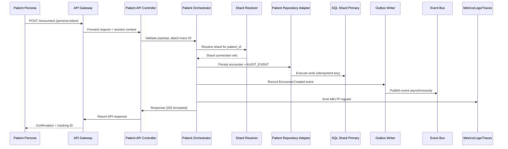
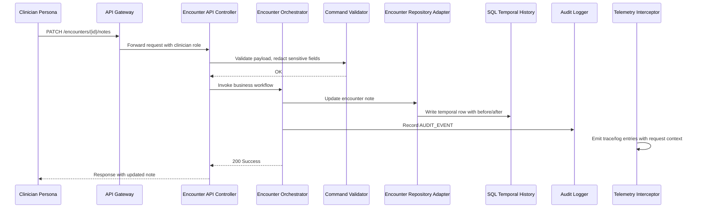
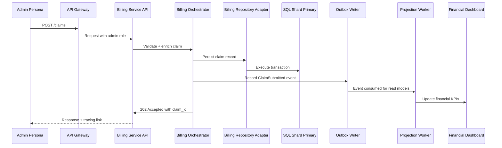
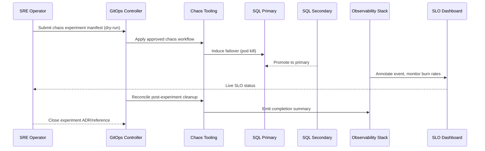

title: PIM SRE Lab Runtime Sequence Catalog
doc_type: runtime_sequence_catalog
status: draft
version: 0.2.0
owners:
  - docs@pim-sre.lab
last_updated: 2025-05-19
tags:
  - runtime
  - sequence
---

# Runtime Sequence Overview

This catalog captures the critical runtime narratives that prove the PIM SRE Lab satisfies its requirements for realistic healthcare workloads, observability depth, and resilience (BR-01, BR-06, BR-11). Each sequence links business personas to the MELTP telemetry, audit trails, and GitOps workflows that power the lab so operators and GPT agents can reason about end-to-end behavior (BR-12, BR-16, FR-06.5). Use these sequences to drive design reviews, automated tests, chaos drills, and documentation cross-links.

## Scenario Index

| Scenario | Description | Primary Actors | Notes |
| --- | --- | --- | --- |
| Patient Books Encounter | Patient schedules a visit, triggering shard-aware writes, outbox events, and dashboards updates | Patient Persona, API Gateway, Patient Service, Outbox | Tests BR-01, FR-04.1, FR-14.2, FR-06.5 |
| Clinician Documents Encounter | Clinician records clinical notes and telemetry annotations | Clinician Persona, Encounter Service, Audit Logger, Observability Stack | Validates BR-06, FR-07.1, FR-13.1 |
| Billing Submits Claim | Admin persona posts a claim, projection workers generate financial summaries | Admin Persona, Billing Service, Projection Worker, SQL AG | Covers BR-14, FR-14.4, FR-17.1 |
| Chaos-Induced Failover | SRE triggers chaos event, infrastructure fails over, SLOs monitored | SRE Operator, GitOps Controller, SQL AG, Observability Stack | Demonstrates BR-05, BR-11, FR-05.2, NFR-34 |

## Detailed Sequences

### Scenario: Patient Books Encounter

**Key Steps**
- Authenticate persona and propagate shard metadata (FR-08.4, FR-04.1).
- Write encounter data with temporal history and audit logging (FR-07.1, FR-07.2).
- Publish outbox event for downstream projections and dashboards (FR-14.2).
- Emit MELTP telemetry with persona/shard labels (FR-06.5).

**Instrumentation Notes**
- Metrics: `http_server_duration_seconds`, `encounter_write_latency`, `eventbus_publish_latency`.
- Logs: Structured JSON with `trace_id`, `user_id`, `persona`, `shard_id`.
- Traces: Tempo spans covering gateway → API → orchestrator → SQL.
- Profiles: Pyroscope sampling around orchestrator hot paths.

**Failure Modes**
- Shard map stale or missing entry (FR-04.2) → fallback to cached shard, emit warning, trigger ADR review.
- SQL transient failure (FR-05.3) → orchestrator retries with exponential backoff.
- Outbox publish failure → event remains in outbox monitored by dead-letter alerts (FR-14.5).

**Related Runbooks / Playbooks**
- `docs/runbooks/05_encounter-write.md`
- `docs/runbooks/20_event-outbox-dlq.md`
- Integration test: `tests/runtime/encounter_booking_sequence.spec`

### Scenario: Clinician Documents Encounter

**Key Steps**
- Enforce clinician role and RLS checks before mutation (FR-08.1, FR-08.2).
- Apply validator redaction and glossary consistency (FR-02.4, FR-16.4).
- Persist temporal history and audit events (FR-07.2, FR-07.3).
- Emit telemetry linking user actions to traces and dashboards (FR-06.2, FR-13.1).

**Instrumentation Notes**
- Metrics: `encounter_note_update_duration`, `audit_event_write_total`.
- Logs: Redacted note content; includes `actor_role`, `request_id`.
- Traces: Span set showing validator, repository, audit logger.
- Alerts: Notification if audit write latency exceeds NFR-09 threshold.

**Failure Modes**
- Validator rejects payload due to missing context (FR-07.4) → return 422 with remediation guidance.
- Temporal history write failure → orchestrator aborts, returns 503, raises incident.
- Audit store unavailable → degrade to queue-based buffering with SRE alert (NFR-20).

**Related Runbooks / Playbooks**
- `docs/runbooks/11_audit-log-degradation.md`
- `docs/runbooks/07_temporal-history-repair.md`
- Load test traces: `dashboards/clinician-documentation.json`

### Scenario: Billing Submits Claim

**Key Steps**
- Ensure admin role and guardrails for financial operations (FR-08.3, FR-18.1).
- Persist claim data with retention and archival policies (FR-17.1, NFR-23).
- Trigger projection pipeline to refresh near-real-time dashboards (FR-14.4).
- Provide traceable journey linking claim submission to financial view (FR-16.2).

**Instrumentation Notes**
- Metrics: `claim_submit_latency`, `projection_worker_lag_seconds`.
- Logs: Claim metadata (masked), correlation IDs across services.
- Traces: Show path from API to projection update; annotate dashboards.
- Alerts: Burn rate on `claim_projection_staleness` SLI.

**Failure Modes**
- Projection backlog growth → triggers DLQ alert and runbook escalation (FR-14.5).
- SQL replica lag beyond threshold → SRE notified to adjust read distribution (FR-04.3).
- Admin misuse attempt flagged by guardrails → 403 response, audit entry (FR-08.3).

**Related Runbooks / Playbooks**
- `docs/runbooks/18_projection-backlog.md`
- `docs/runbooks/22_financial-dashboard-validation.md`
- Chaos checklists: `docs/runbooks/40_claim-chaos-drill.md`

### Scenario: Chaos-Induced Failover

**Key Steps**
- Chaos manifest includes blast radius, duration, and ADR link (FR-11.1, NFR-34).
- Failover validated by monitoring SQL AG promotion and request retries (FR-05.2, FR-05.3).
- Observability annotations and dashboards confirm MELTP coverage during chaos (FR-06.5, FR-10.3).
- Post-experiment automation restores replicas and logs outcomes (NFR-35).

**Instrumentation Notes**
- Metrics: `sql_failover_duration_seconds`, `api_error_ratio`, `chaos_experiment_active`.
- Logs: Chaos controller actions with request IDs.
- Traces: Capture retry paths and failover handoff.
- Profiles: Optional CPU profiling during chaos to detect bottlenecks.

**Failure Modes**
- Chaos tool misconfiguration → GitOps dry-run failure blocks execution.
- Failover exceeds RTO → triggers critical alert and runbook `docs/runbooks/30_sql-failover.md`.
- Burn rate breach → auto-page on-call SRE with context.

**Related Runbooks / Playbooks**
- `docs/runbooks/30_sql-failover.md`
- `docs/runbooks/32_chaos-controller.md`
- ADR reference: `docs/ADR/ADR-012-chaos-governance.md`

## Observability and Validation

Automated integration tests in CI replay each scenario using synthetic datasets defined in `docs/requirements/notes/*.md` with assertions on telemetry presence (FR-01.5, FR-06.5). Synthetic probes execute hourly via chaos-safe schedules to ensure SLOs remain within thresholds (FR-10.1, NFR-11). Dashboards provide per-scenario views linking metrics, logs, and traces; `make validate-sequences` verifies diagrams and documentation stay current. GPT agents reference this catalog when planning work or assessing incidents per the GPT Working Agreement.

## Risks and Gaps

- Need to add partner integration scenarios once external personas are formalized (BR-16).
- Sequence diagrams rely on manual Mermaid updates; evaluate automated export from tracing tools (FR-13.2).
- Ensure runbook references stay synchronized with Docs Index and guardrails (NFR-36).
- Open question: Should release strategy promotion flow be added as a runtime sequence? Track in backlog task [90].

## References

- `docs/Architecture/00_Design_Doc.md`
- `docs/requirements/notes/Runtime_Sequence_Catalog_Applicable_Requirements.md`
- `docs/Architecture/05_C4_L1_System_Context.md`
- `docs/Architecture/06_C4_L2_Containers.md`
- `docs/Architecture/07_C4_L3_Components.md`
- `docs/runbooks/`
- `docs/ADR/ADR_Index.md`
- `dashboards/sequence-catalog/`

---

#### Notes

Last updated: 2025-05-19 (update before publishing)
