title: PIM SRE Lab Domain Context Map
doc_type: domain_context_map
status: draft
version: 0.2.0
owners:
  - docs@pim-sre.lab
last_updated: 2025-05-19
tags:
  - domain
  - ddd
---

# Domain Context Overview

The PIM SRE Lab models healthcare workflows across patient engagement, clinical encounters, and revenue operations using synthetic data to satisfy educational and observability-focused outcomes (BR-01, BR-02, BR-16). This context map outlines the bounded contexts, their responsibilities, and integration contracts so architects, SREs, and GPT agents can reason about change impact, traceability, and compliance (BR-07, BR-14). Each boundary aligns with requirements for shard locality, GitOps reproducibility, telemetry depth, and chaos readiness (BR-04, BR-09, BR-06, BR-11).

## Context Map Diagram

```mermaid
flowchart LR
    subgraph PatientEngagement["Patient Engagement Context"]
        Portal["Portal UI/Persona Scripts"]
    end
    subgraph ClinicalCare["Clinical Care Context"]
        Encounters["Encounter Management"]
        Orders["Order & Procedure Tracking"]
    end
    subgraph RevenueCycle["Revenue Cycle Context"]
        Claims["Claims Processing"]
        Billing["Billing & Invoicing"]
    end
    subgraph Observability["Observability & Narratives Context"]
        Telemetry["MELTP Pipelines"]
        Narratives["Storytelling Dashboards"]
    end
    subgraph PlatformOps["Platform Operations Context"]
        GitOps["GitOps Automation"]
        Chaos["Chaos & DR Tooling"]
    end
    subgraph SharedServices["Shared Services Context"]
        Identity["Identity & Access"]
        DataPlatform["Sharded SQL/Data Platform"]
        EventHub["Event Hub"]
    end

    PatientEngagement -->|Published Language| ClinicalCare
    ClinicalCare -->|Domain Events| RevenueCycle
    RevenueCycle -->|Projection Feed| Observability
    PlatformOps -->|Automation Hooks| ClinicalCare
    PlatformOps -->|Automation Hooks| RevenueCycle
    Observability -->|Dashboards & SLOs| PlatformOps
    PatientEngagement -->|Persona Telemetry| Observability
    ClinicalCare -->|Audit Calls| SharedServices
    RevenueCycle -->|Audit Calls| SharedServices
    PlatformOps -->|GitOps Control| SharedServices
    SharedServices -->|Identity Tokens| PatientEngagement
```

_Source:_ `docs/architecture/diagrams/domain_context_map.mmd`.

## Bounded Contexts

| Context | Responsibilities | Key Consumers | Notes |
| --- | --- | --- | --- |
| Patient Engagement | Persona simulators and portals that capture patient journeys, appointments, and notifications (BR-01, FR-01.2) | Clinical Care, Observability | Ensures synthetic personas remain realistic without leaking PHI (FR-02.1, NFR-24) |
| Clinical Care | Manages encounters, orders, documentation, and clinical telemetry (BR-01, BR-06) | Revenue Cycle, Observability, Shared Services | Enforces shard locality, audit logging, and chaos readiness (FR-04.1, FR-07.1, FR-11.1) |
| Revenue Cycle | Handles claims, billing, reporting, and financial projections (BR-14, BR-15) | Observability, Platform Ops | Maintains retention and archival policies per FR-17.1, NFR-23 |
| Observability & Narratives | Aggregates MELTP signals, dashboards, SLOs, and narrative artifacts (BR-06, BR-16) | All contexts | Provides self-documenting telemetry and storyboarding for GPT/humans (FR-06.5, NFR-37) |
| Platform Operations | GitOps automation, CI/CD, chaos tooling, runbooks (BR-09, BR-11, BR-12) | All contexts | Implements guardrails, ADR-driven decisions, and release strategy enforcement (FR-09.4, FR-10.3) |
| Shared Services | Identity, sharded data platform, event hub, secrets, and temporal history (BR-07, BR-08) | All contexts | Supplies foundational contracts for security and consistency (FR-08.4, FR-14.2) |

## Context Relationships

| Relationship | Description | Pattern | Contract |
| --- | --- | --- | --- |
| Patient Engagement → Clinical Care | Patient context orchestrates appointments into encounter workflows | Published Language | REST API (patient/encounter endpoints) with shard-aware IDs (FR-04.1) |
| Clinical Care → Revenue Cycle | Encounter completion triggers billing claims | Domain Event, Outbox | `EncounterCompleted` event schema versioned in event hub (FR-14.2, FR-14.3) |
| Revenue Cycle → Observability | Claims projections update dashboards and SLO burn rates | Projection Feed | CDC feed into Grafana dashboards and alert rules (FR-10.1, FR-14.4) |
| Platform Ops ↔ Shared Services | GitOps controllers manage infrastructure states | Conformist | Flux/Argo APIs, ADR-indexed change policies (FR-09.1, FR-X.1) |
| Observability ↔ Platform Ops | Telemetry informs chaos and release decisions | Customer/Supplier | Alert webhooks, SLO dashboards with deployment annotations (FR-10.3, NFR-33) |
| Shared Services → All Contexts | Identity, data, and event infrastructure consumed everywhere | Canonical Model + ACL | OIDC tokens, SQL/Redis adapters, schema registry (FR-08.1, FR-14.3) |

## Anti-Corruption and Integration Layers

- API gateway and session brokers translate external persona requests into canonical session context, preventing leakage of downstream data models (FR-08.4, FR-02.3).
- Patient and clinical contexts expose published language DTOs; platform adapters translate to internal aggregates while protecting invariants (FR-03.4, FR-16.3).
- Revenue cycle leverages projection builders that subscribe to canonical events and map them to financial schemas without mutating upstream data (FR-14.4).
- Observability context uses adapters that enrich telemetry with glossary-coherent labels, shielding dashboards from raw internal tokens (FR-06.5, FR-16.4).
- GitOps pipelines include policy checks (Kyverno/OPA) acting as anti-corruption layers for infrastructure manifests (FR-09.4, NFR-12).

## Domain Events and Shared Concepts

- Events: `EncounterCreated`, `EncounterCompleted`, `ClaimSubmitted`, `TelemetryAnnotated`, `ChaosExperimentStarted`, `ChaosExperimentCompleted` (FR-14.2, FR-11.1).
- Shared vocabulary: Patient, Clinician, Encounter, Claim, Shard, Persona, Audit Event, SLO Burn, Chaos Run (FR-16.2, FR-16.4).
- Cross-context IDs follow the ID registry patterns (`BR-###`, `FR-###`, `NFR-###`, `ENC-####`, `CLAIM-####`) ensuring traceability (FR-X.1, BR-07).
- Glossary entries in `docs/02_Glossary.md` define canonical meanings, prioritized for GPT/human alignment.

## Risks and Open Questions

- Potential overlap between clinical and revenue contexts when handling retroactive billing adjustments; consider introducing a reconciliation context (BR-14, FR-15.2). Owner: Billing Domain Team.
- Need automated checks ensuring event schemas remain backward compatible; evaluate schema registry governance (FR-14.3). Owner: Event Platform Team.
- Observability narratives may drift from domain language; schedule quarterly glossary audits (BR-16, FR-16.4). Owner: Documentation Guild.
- Open question: Do we require a dedicated “Education” context to orchestrate tutorials and ADR references? Track via backlog and potential ADR.
- Risk of GitOps drift when external tooling interacts with shared services; enforce policy agent coverage during integration (FR-09.3, NFR-12). Owner: Platform Ops.

## References

- `docs/Architecture/00_Design_Doc.md`
- `docs/Architecture/05_C4_L1_System_Context.md`
- `docs/Architecture/06_C4_L2_Containers.md`
- `docs/Architecture/07_C4_L3_Components.md`
- `docs/requirements/notes/Domain_Context_Map_Applicable_Requirements.md`
- `docs/requirements/notes/Event_Architecture_Applicable_Requirements.md`
- `docs/02_Glossary.md`
- `docs/ADR/ADR_Index.md`

---

#### Notes

Last updated: 2025-05-19 (update before publishing)
