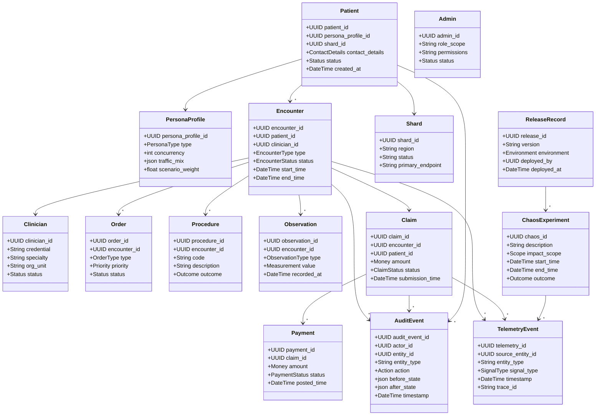

title: PIM SRE Lab Domain Model UML
doc_type: domain_model
status: draft
version: 0.2.0
owners:
  - docs@pim-sre.lab
last_updated: 2025-05-19
tags:
  - domain
  - uml
---

# Domain Model Overview

The domain model captures the healthcare simulation entities, operations, and supporting platform artifacts required to deliver realistic patient/clinician/admin workflows while remaining synthetic and auditable (BR-01, BR-02, BR-07). Entities emphasize shard-aware identifiers, temporal history, and event publication so reliability, chaos, and observability goals remain measurable (BR-06, BR-11, FR-06.5). This model guides service contracts, data stores, and educational narratives used by GPT agents and human operators (BR-12, BR-16).

## UML Diagram

_Source:_ `docs/architecture/diagrams/domain_model_uml.mmd`.

## Entity Catalog

| Entity | Description | Key Attributes | Relationships |
| --- | --- | --- | --- |
| Patient | Core persona receiving care; links personas to shard-aware data (BR-01, FR-04.1) | `patient_id`, `persona_profile_id`, `shard_id`, `contact_details`, `status` | Many Encounters; optional Claims; belongs to Shard |
| PersonaProfile | Simulation profile driving persona traffic (FR-01.5) | `persona_profile_id`, `type`, `concurrency`, `traffic_mix` | Referenced by Patient |
| Clinician | Provider delivering care scenarios (BR-01) | `clinician_id`, `credential`, `specialty`, `status` | Assigned to Encounters, authorizes Orders |
| Admin | Back-office persona governing claims and audits (BR-08) | `admin_id`, `role_scope`, `permissions`, `status` | Initiates Claims, owns audit reviews |
| Encounter | Clinical interaction capturing notes, telemetry, events (BR-06, FR-06.5) | `encounter_id`, `patient_id`, `clinician_id`, `status`, `type`, `start_time` | Aggregates Orders, Procedures, Observations, Claim |
| Order | Diagnostic/treatment instruction (FR-01.3) | `order_id`, `encounter_id`, `type`, `priority`, `status` | Belongs to Encounter |
| Procedure | Clinical procedure record (FR-15.1) | `procedure_id`, `encounter_id`, `code`, `outcome` | Belongs to Encounter |
| Observation | Vital/lab measurement (FR-06.3) | `observation_id`, `encounter_id`, `type`, `value`, `recorded_at` | Belongs to Encounter |
| Claim | Billing artifact derived from encounters (BR-14) | `claim_id`, `patient_id`, `encounter_id`, `amount`, `status` | Associates Payments, references Encounter |
| Payment | Records remittance for claims (FR-14.4) | `payment_id`, `claim_id`, `amount`, `status` | Belongs to Claim, triggers projections |
| AuditEvent | Immutable history of changes (BR-07) | `audit_event_id`, `actor_id`, `entity_id`, `before_state`, `after_state` | Linked to Patient, Encounter, Claim, etc. |
| TelemetryEvent | Reference to MELTP artifacts (BR-06) | `telemetry_id`, `source_entity_id`, `signal_type`, `trace_id` | Cross-context; Observability consumes |
| Shard | Locality boundary for data scaling (BR-04) | `shard_id`, `region`, `status`, `primary_endpoint` | Parent for Patients, Encounters |
| ReleaseRecord | Deployment provenance (BR-09) | `release_id`, `version`, `environment`, `deployed_at` | Owns ChaosExperiments |
| ChaosExperiment | Chaos drill metadata (BR-11) | `chaos_id`, `description`, `impact_scope`, `outcome` | Linked to ReleaseRecord, TelemetryEvent |

## Aggregates and Value Objects

- **Patient Aggregate** — Root: Patient; encapsulates persona profile reference and encounter IDs. Invariants: patient_id unique within shard; persona profile must exist (FR-01.5, FR-04.1).
- **Encounter Aggregate** — Root: Encounter; controls Orders, Procedures, Observations, ensuring audit/telemetry emission for transitions (FR-06.5, FR-07.2).
- **Claim Aggregate** — Root: Claim; manages Payments, projections, and financial invariants (FR-14.4, FR-17.1).
- **PlatformOps Aggregate** — Root: ReleaseRecord; ties chaos experiments and deployment metadata for reproducibility (FR-09.1, FR-11.1).
- **Value Objects** — `ContactDetails`, `Address`, `Money`, `Measurement`, `TelemetrySignal`, `AuditMetadata`, `PersonaTrafficProfile` enforce format, validation, and redaction rules (FR-02.3, FR-X.1).

## State, Lifecycle, and Transitions

- **Patient**: `Registered → Active → Suspended → Retired`; transitions emit audit events and notify observability dashboards (FR-07.1, FR-16.2).
- **Encounter**: `Scheduled → InProgress → Completed → Archived`; completion spawns domain events and claim generation; archival enforces retention timelines (FR-14.2, FR-17.2).
- **Claim**: `Draft → Submitted → Adjudicated → Closed`; adjudication depends on projections; closing locks records for audit (FR-14.4, FR-15.1).
- **ChaosExperiment**: `Planned → Running → Completed → Remediated`; running state requires SRE approval and annotates SLO dashboards (NFR-34, NFR-35).

## Integration and Mapping

- Domain entities map to sharded SQL schemas (`Patient_<shard_id>`, `Encounter_<shard_id>`, `Claim_<shard_id>`) with temporal tables enabling rewind and audit queries (FR-04.3, FR-07.2).
- Outbox tables (`Outbox_Patient`, `Outbox_Encounter`, etc.) feed the event hub for downstream contexts and observability narratives (FR-14.2).
- REST DTOs derive from OpenAPI specs so published language stays aligned with the domain model; component adapters manage transformations (FR-X.1, FR-16.3).
- TelemetryEvent links to MELTP storage (Prometheus/Loki/Tempo) and the SLI/SLO measurement plan, ensuring traceability (FR-06.3, FR-10.1).

## Constraints and Invariants

- Patients must reference a valid shard; remapping requires ADR and orchestrated migration (FR-04.2).
- Encounters require both patient and clinician references and may not be deleted—only state transitions are allowed (FR-07.4).
- Claims must reconcile with related procedures/observations; Money value object enforces currency precision (FR-14.4, NFR-29).
- AuditEvent entries are immutable, signed, and retained per compliance windows (FR-07.1, NFR-23).
- ChaosExperiments cannot overlap per shard; guardrails enforce single active experiment scope (NFR-34).

## Risks and Open Questions

- Introduce `PaymentPlan` entity for installment scenarios; pending ADR (BR-14).
- Evaluate if a `GoldenSignal` value object is needed to unify telemetry semantics (FR-06.3).
- Confirm whether ReleaseRecord should store external CI metadata (FR-09.2).
- Determine anonymization strategy if synthetic schema evolves; may require new value objects (FR-02.1).
- Decide on ADR coverage for TelemetryEvent schema governance to prevent drift (FR-14.3).

## References

- `docs/Architecture/00_Design_Doc.md`
- `docs/Architecture/06_C4_L2_Containers.md`
- `docs/Architecture/07_C4_L3_Components.md`
- `docs/requirements/notes/Domain_Model_UML_Applicable_Requirements.md`
- `docs/requirements/notes/Runtime_Sequence_Catalog_Applicable_Requirements.md`
- `docs/Architecture/12_Event_Architecture.md`
- `docs/ADR/ADR_Index.md`

---

#### Notes

Last updated: 2025-05-19 (update before publishing)
