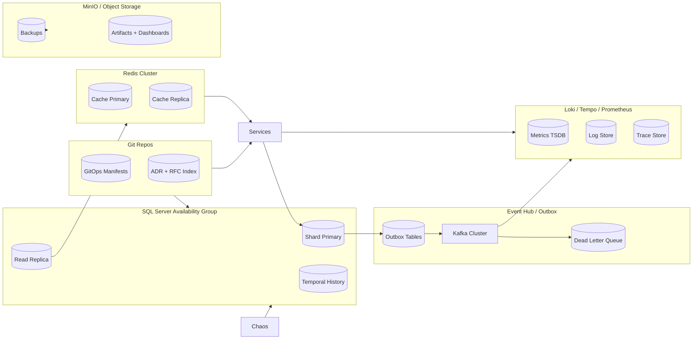

title: PIM SRE Lab Storage Topology
doc_type: storage_topology
status: draft
version: 0.2.0
owners:
  - docs@pim-sre.lab
last_updated: 2025-05-19
tags:
  - storage
  - topology
---

# Storage Topology Overview

The PIM SRE Lab storage landscape balances synthetic safety with realistic operational behavior across OLTP, event streaming, caching, telemetry, and artifact storage. Each tier must satisfy shard locality, audit retention, chaos readiness, and GitOps reproducibility requirements (BR-02, BR-04, BR-07, BR-11). This topology enables consistent narratives for reliability drills, observability, and educational storytelling (BR-06, BR-12, BR-16).

## Topology Diagram

_Source:_ `docs/architecture/diagrams/storage_topology.mmd`.

## Storage Components

| Store / Service | Purpose | Data Classification | Notes |
| --- | --- | --- | --- |
| SQL Server AG (Primary + Replica) | Authoritative OLTP store for clinical and revenue data (BR-01, BR-04) | Synthetic PHI-like | Always On AG with synchronous primary and async replica; temporal tables for history (FR-07.2) |
| Outbox Tables | Transactional event journal per bounded context (FR-14.2) | Synthetic operational | Co-located with OLTP shards; TTL for processed entries; monitored via DLQ |
| Redis Cache | Low-latency cache for reference data/session hints (FR-04.4) | Synthetic operational | Clustered Redis with persistence disabled; eviction policies enforce freshness |
| Object Storage (MinIO) | Stores backups, artifacts, dashboards, ADR exports (FR-17.1) | Synthetic/Operational | Versioned buckets, SSE encryption, lifecycle policies per NFR-23 |
| Event Hub (Kafka/Redpanda) | Durable event streaming backbone and replay buffer (BR-14) | Synthetic operational | Replication factor ≥3, log retention 7 days plus archival snapshots |
| Observability Store (Prometheus/Loki/Tempo/Pyroscope) | Telemetry warehouse for MELTP signals (BR-06) | Operational telemetry | Multi-tenant retention aligned with NFR-33; hot/cold tiers for cost control |
| GitOps Repo (Git) | Source of truth for manifests, policies, design docs (BR-09) | Operational metadata | Nightly backups, read-only mirrors for DR, signed commits enforced |
| ADR/RFC Storage | Persistent decision and proposal records (BR-07) | Operational metadata | Stored alongside Git; indexed via Docs Index and SPEC.md |

## Replication, Backup, and DR

- **SQL Server AG** — Synchronous replication within region, async DR replica cross-region; full backups nightly, differential every 6 hours, log backups every 15 min (FR-17.2, NFR-29). RPO ≤ 5 min, RTO ≤ 30 min.
- **Outbox Tables** — Protected by AG replication; processed entries trimmed after 48 hours. DLQ events backed up to MinIO weekly for audit (FR-14.5).
- **Redis Cache** — Treated as ephemeral; cross-zone replicas for failover; warm-up scripts rehydrate caches from OLTP on failback (FR-05.1).
- **Object Storage** — Replicated across availability zones; versioning ensures accidental deletion recovery; monthly immutability window for critical backups (NFR-23).
- **Event Hub** — Cluster spans three nodes; MirrorMaker-ish jobs copy topics to DR cluster daily; schema registry snapshots stored in GitOps repo (FR-14.3).
- **Observability Stores** — Prometheus remote-write to long-term store; Loki/Tempo/Pyroscope replicate indexes across zones; backups streamed to MinIO nightly (FR-06.3).
- **GitOps/ADR Repos** — Primary hosted on GitHub with scheduled mirror sync to internal bare repo; weekly encrypted snapshot to object storage (FR-09.2).

## Capacity and Performance

- **OLTP** — Sized for national-scale simulation with shard partitioning; baseline 64 vCores primary, 32 vCores replica; autoscale via shard addition (FR-03.2, FR-04.2).
- **Cache** — Peak capacity sized for 10M persona sessions; eviction strategy ensures ≤5 ms latency (NFR-06).
- **Event Hub** — Throughput capacity 50 MB/s per broker; partitions aligned to shards/personas; monitored for lag (FR-14.4, NFR-10).
- **Object Storage** — Retains 90 days of backups on hot tier; archives older backups to cold storage with retrieval SLA 4 hours (NFR-27).
- **Telemetry Stores** — Prometheus retains 30 days hot, 400 days cold; Loki/Tempo choose compaction windows to control cardinality (FR-06.3, NFR-30).

## Security and Compliance

- Encryption at rest using AES-256 for OLTP, object storage, and observability data (FR-02.3, NFR-24).
- All transit secured via TLS 1.2+; mutual TLS between services and storage endpoints where supported (NFR-16).
- Access control enforced via RBAC, Azure AD/OIDC integration, and vault-issued credentials; GitOps pipelines manage secret rotation (FR-08.4, NFR-20).
- Audit logs stored in temporal tables, event hub topics, and object storage archives; retention meets policy windows (FR-07.1, NFR-23).
- Compliance guardrails follow HIPAA-like controls despite synthetic data: least privilege, segregation of duties, documented runbooks (BR-08, NFR-18).

## Operations and Monitoring

- `make storage-validate` runs schema drift checks, backup verification, and retention policy tests.
- Grafana dashboards monitor replication lag, cache hit ratios, event lag, backup status, and object storage capacity (FR-10.1, NFR-13).
- Alerting integrates with on-call rotations; anomalies create incident tickets and require postmortem updates to ADR/RFC (FR-11.2).
- Runbooks: `docs/runbooks/25_storage-failover.md`, `docs/runbooks/26_backup-restore.md`, `docs/runbooks/27_event-hub-lag.md`. Chaos drills validate failover and restore steps quarterly (NFR-34, NFR-35).

## Risks and Open Questions

- Evaluate adoption of managed storage services for future scalability; track via ADR (BR-03).
- Need automated verification of schema registry snapshots during GitOps pipeline (FR-14.3).
- Assess cost of long-term telemetry retention; consider tiered storage strategies (NFR-27).
- Confirm encryption key rotation schedule aligns with compliance expectations (NFR-20).
- Open question: Should we introduce a document store for narrative artifacts to reduce load on object storage? Pending investigation.

## References

- `docs/Architecture/04_Infrastructure_Architecture.md`
- `docs/Architecture/00_Design_Doc.md`
- `docs/requirements/notes/Storage_Topology_Applicable_Requirements.md`
- `docs/Architecture/16_Availability_DR_Topology.md`
- `docs/Architecture/14_Observability_Signal_Dictionary.md`
- `docs/runbooks/`
- `docs/ADR/ADR_Index.md`

---

#### Notes

Last updated: 2025-05-19 (update before publishing)
